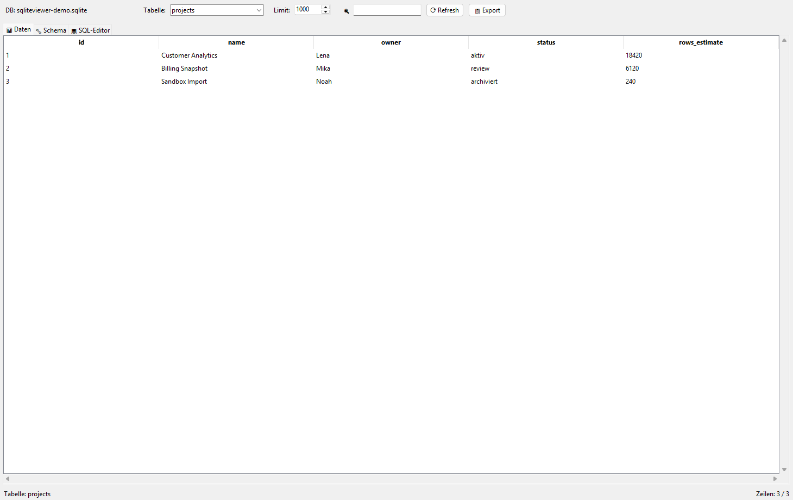

# SQLiteViewer

[Deutsch](README_de.md)

Local-first SQLite database browser for Windows, Linux, and macOS. Open a `.db`, `.sqlite`, or `.sqlite3` file, inspect tables, search rows, run SQL, and export CSV or JSON without sending database content anywhere.


## Start Here

| Need | Start with |
|---|---|
| Browse a local SQLite database | `python SQLiteViewer.py path/to/database.sqlite` |
| Inspect tables and schema | Data and Schema tabs |
| Run a custom query | SQL Editor tab, then `F9` |
| Export visible data | `File > Export as CSV` or `File > Export as JSON` |
| Build a Windows package | `SQLiteViewer.spec`, `build_exe.bat`, and `STORE_LISTING.md` |
| Read the German guide | [`README_de.md`](README_de.md) |
| Machine-readable project summary | [`llms.txt`](llms.txt) |

## Screenshot



The screenshot shows the table browser with the integrated schema and SQL workflow tabs.

## Why This Exists

SQLiteViewer is meant for quick local inspection of small and medium SQLite files: app databases, exported research data, test fixtures, prototype storage, and support/debugging snapshots. It stays intentionally small and portable:

- **Local-first**: database files remain on your machine.
- **No service account**: no hosted backend, telemetry, or cloud sync.
- **No heavyweight install**: Python standard library plus Tkinter.
- **Readable export**: CSV for spreadsheets, JSON for companion workflows.
- **Simple handoff**: a single source file plus documented Store packaging assets.

## Features

- **Table browser**: list tables and browse rows in a sortable grid.
- **Schema view**: inspect `CREATE TABLE` statements with syntax highlighting.
- **SQL editor**: run custom queries and view result sets.
- **Search**: filter visible table rows across columns.
- **CSV export**: export selected table or query output.
- **JSON export**: write `sqliteviewer-export-v1.json` with source metadata and rows.
- **Direct file launch**: pass a database path when starting the app.
- **Keyboard shortcuts**: `Ctrl+O`, `Ctrl+F`, `Ctrl+E`, `F5`, and `F9`.

## Install And Run

Requirements:

- Python 3.10 or newer
- Tkinter, included with most Python distributions

Run from source:

```bash
git clone https://github.com/file-bricks/SQLiteViewer.git
cd SQLiteViewer
python SQLiteViewer.py
```

Open a database directly:

```bash
python SQLiteViewer.py path/to/database.sqlite
```

On Windows you can also double-click `START.bat`.

## Usage

1. Open a database with `File > Open Database`, `Ctrl+O`, or a startup argument.
2. Select a table from the dropdown.
3. Type into the search field to filter visible rows.
4. Switch to the Schema tab to inspect table definitions.
5. Switch to the SQL Editor tab, write a query, and press `F9`.
6. Export via `File > Export as CSV` or `File > Export as JSON`.

## Keyboard Shortcuts

| Shortcut | Action |
|---|---|
| `Ctrl+O` | Open database |
| `Ctrl+Q` | Quit |
| `Ctrl+E` | Export CSV |
| `Ctrl+F` | Focus search |
| `Ctrl+A` | Select all rows |
| `F5` | Refresh table |
| `F9` | Execute SQL query |

## Export Format

CSV remains the fastest default export path. The JSON export is additive and intended for companion tools, reproducible support handoffs, or LLM-assisted inspection where metadata matters.

See [`EXPORTFORMAT.md`](EXPORTFORMAT.md) for the `sqliteviewer-export-v1.json` contract.

## Search Context

This repository is `file-bricks/SQLiteViewer`: a Python/Tkinter desktop SQLite viewer for local database inspection, CSV export, JSON companion export, and quick support handoffs. It is different from DB Browser for SQLite, DBeaver, Android SQLite viewer apps, iOS debug libraries, hosted SQL dashboards, and web-based database admin panels. Useful search phrases include:

- `file-bricks SQLiteViewer`
- `file-bricks/SQLiteViewer`
- `local-first SQLite viewer Python Tkinter`
- `portable SQLite database browser with CSV JSON export`
- `offline SQLite browser for Windows Python`
- `SQLite table browser SQL editor Tkinter`
- `Python Tkinter SQLite GUI browser`
- `SQLite Viewer Pro Microsoft Store`

## Comparison

| Feature | SQLiteViewer | DB Browser for SQLite | DBeaver |
|---|:---:|:---:|:---:|
| Local file browsing | Yes | Yes | Yes |
| SQL queries | Yes | Yes | Yes |
| Schema view | Yes | Yes | Yes |
| CSV export | Yes | Yes | Yes |
| JSON companion export | Yes | No | Partial |
| Python standard library core | Yes | No | No |
| Lightweight source checkout | Yes | Partial | No |
| No account or backend | Yes | Yes | Yes |

## Technical Details

- **Framework**: Tkinter and ttk
- **Database access**: Python `sqlite3`
- **Runtime dependencies**: Python standard library
- **Primary entrypoint**: `SQLiteViewer.py`
- **Packaging**: `SQLiteViewer.spec`, `build_exe.bat`, `store_package.json`
- **License**: MIT

## German Guide

For German installation, usage, privacy boundaries, and search context, see [`README_de.md`](README_de.md).

## License

[MIT](LICENSE)

## Haftung / Liability

Dieses Projekt ist eine unentgeltliche Open-Source-Schenkung im Sinne der §§ 516 ff. BGB. Die Haftung des Urhebers ist gemäß § 521 BGB auf Vorsatz und grobe Fahrlässigkeit beschränkt. Ergänzend gilt der Haftungsausschluss der MIT-Lizenz.

Nutzung auf eigenes Risiko. Keine Wartungszusage, keine Verfügbarkeitsgarantie, keine Gewähr für Fehlerfreiheit oder Eignung für einen bestimmten Zweck.

This project is an unpaid open-source donation. Liability is limited to intent and gross negligence (§ 521 German Civil Code). Use at your own risk. No warranty, no maintenance guarantee, no fitness-for-purpose assumed.
