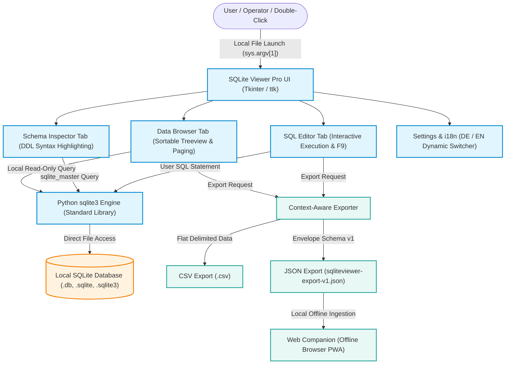
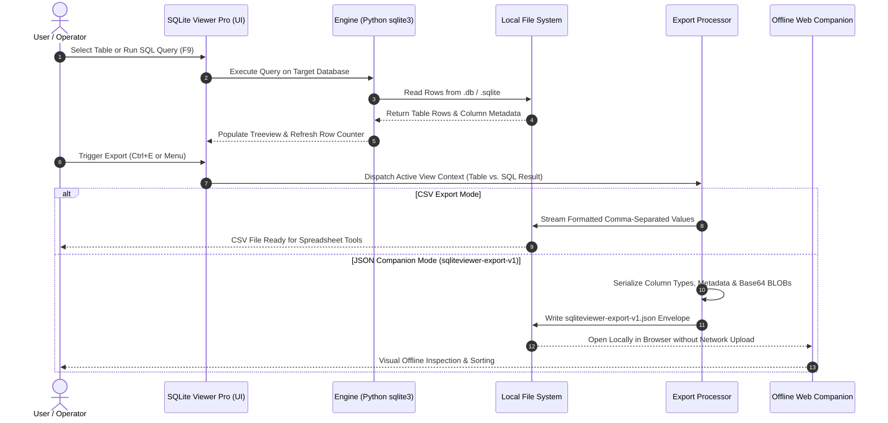

# SQLiteViewer

<p align="center">
  <a href="https://www.python.org/"></a>
  <a href="LICENSE"></a>
  <a href="tests/"></a>
  <a href="store_package.json"></a>
  <a href="THIRD_PARTY_LICENSES.md"></a>
  <a href="THIRD_PARTY_LICENSES.md"></a>
  <a href="SECURITY.md"></a>
  <a href="https://github.com/file-bricks"></a>
  <a href="https://github.com/open-bricks"></a>
  <a href="llms.txt"></a>
</p>

<p align="center">
  <b>English</b> | <a href="README_de.md">Deutsch</a>
</p>

> [!NOTE]
> **SQLiteViewer** (branded on Windows as *SQLite Viewer Pro*) is an unprivileged, local-first SQLite database browser built with standard Python and Tkinter. It guarantees **Zero Network Egress**, requires **zero external pip runtime dependencies**, and operates 100% offline. Machine-readable project context is indexed in [`llms.txt`](llms.txt).

---

## Quick Navigation

1. [What is SQLiteViewer?](#what-is-sqliteviewer)
2. [Target Personas & Discoverability](#target-personas--discoverability)
3. [Architecture & Data Flow](#architecture--data-flow)
4. [Export Lifecycle Sequence](#export-lifecycle-sequence)
5. [Comparative Matrix vs. Alternatives](#comparative-matrix-vs-alternatives)
6. [Core Features](#core-features)
7. [Getting Started & Installation](#getting-started--installation)
8. [Usage & Workflow](#usage--workflow)
9. [Keyboard Shortcuts](#keyboard-shortcuts)
10. [Export Contract & Companion](#export-contract--companion)
11. [Microsoft Store & Packaging](#microsoft-store--packaging)
12. [Governance & System Invariants](#governance--system-invariants)
13. [Third-Party Licenses & Transparency](#third-party-licenses--transparency)
14. [Ecosystem & Sister Projects](#ecosystem--sister-projects)
15. [Security & Privacy](#security--privacy)
16. [Contract Tests & Verification](#contract-tests--verification)

---

## What is SQLiteViewer?

**SQLiteViewer** is a lightweight, portable desktop browser for `.db`, `.sqlite`, and `.sqlite3` database files. Designed for developers, researchers, system administrators, and privacy-conscious users, it allows you to open databases instantly, inspect tables and DDL schema definitions, filter records, execute ad-hoc SQL queries, and export data as CSV or structured JSON—all without cloud connectivity or heavy multi-megabyte runtime overhead.


---

## Target Personas & Discoverability

SQLiteViewer is built to serve four primary personas with zero friction:

### `[PERSONA-01]` Python & Desktop App Developers
- **Profile:** Software engineers creating Python (PySide, Tkinter, PyQt), FastAPI, Django, or CLI applications who need an instantaneous, zero-install SQLite inspector to verify test fixtures and state files.
- **Pain Point:** Waiting for a 300+ MB Java IDE (DBeaver) or installing multi-megabyte C++ binaries just to inspect a 20 KB local test database.
- **High-Intent Search Queries:**
  - `local-first SQLite viewer Python Tkinter`
  - `lightweight SQLite browser without bloat`
  - `inspect sqlite3 db from python app`
  - `python tkinter sqlite gui table browser`

### `[PERSONA-02]` Privacy-Conscious Data Analysts & Researchers
- **Profile:** Academics, healthcare data researchers, and analysts working with sensitive, air-gapped survey datasets or clinical databases.
- **Pain Point:** Modern web-based database viewers and cloud-connected dashboards risk data exfiltration and violate strict institutional privacy policies.
- **High-Intent Search Queries:**
  - `offline SQLite database viewer zero network egress`
  - `air-gapped SQLite viewer privacy first`
  - `open source local SQLite explorer`
  - `private sqlite browser no telemetry`

### `[PERSONA-03]` DevOps, System Administrators & IT Support
- **Profile:** Incident responders and support technicians diagnosing application errors on client workstations where administrator elevation is prohibited.
- **Pain Point:** Traditional installers trigger UAC prompts and leave behind registry debris.
- **High-Intent Search Queries:**
  - `portable SQLite viewer Windows unprivileged`
  - `inspect sqlite database RunAsInvoker`
  - `support triage sqlite viewer usb stick`
  - `portable sqlite table browser windows`

### `[PERSONA-04]` Microsoft Store End-Users & Non-Technical Evaluators
- **Profile:** Windows 10/11 users seeking a clean, trustworthy utility to open `.db` or `.sqlite` files by double-clicking them in File Explorer.
- **Pain Point:** Windows provides no built-in viewer for SQLite files, leading users to untrusted online conversion websites.
- **High-Intent Search Queries:**
  - `SQLite Viewer Pro Microsoft Store`
  - `Windows 11 open db file viewer`
  - `double click sqlite file Windows`
  - `sqlite viewer pro store id 9P6H501XB8JT`

---

## Architecture & Data Flow

SQLiteViewer executes in a single unprivileged process (`RunAsInvoker`). The graphical user interface connects directly to Python's built-in `sqlite3` engine, keeping all database interactions entirely local.


```mermaid
flowchart TD
    User(["User / Operator / Double-Click"]) -->|"Local File Launch (sys.argv[1])"| GUI["SQLite Viewer Pro UI (Tkinter / ttk)"]
    GUI --> TabData["Data Browser Tab (Sortable Treeview & Paging)"]
    GUI --> TabSchema["Schema Inspector Tab (DDL Syntax Highlighting)"]
    GUI --> TabSQL["SQL Editor Tab (Interactive Execution & F9)"]
    GUI --> TabSettings["Settings & i18n (DE / EN Dynamic Switcher)"]

    TabData -->|"Local Read-Only Query"| DBEngine["Python sqlite3 Engine (Standard Library)"]
    TabSchema -->|"sqlite_master Query"| DBEngine
    TabSQL -->|"User SQL Statement"| DBEngine

    DBEngine -->|"Direct File Access"| DBFile[("Local SQLite Database (.db, .sqlite, .sqlite3)")]

    TabData -->|"Export Request"| Exporter["Context-Aware Exporter"]
    TabSQL -->|"Export Request"| Exporter

    Exporter -->|"Flat Delimited Data"| CSVFile["CSV Export (.csv)"]
    Exporter -->|"Envelope Schema v1"| JSONFile["JSON Export (sqliteviewer-export-v1.json)"]

    JSONFile -->|"Local Offline Ingestion"| Companion["Web Companion (Offline Browser PWA)"]

    classDef core fill:#e1f5fe,stroke:#0288d1,stroke-width:2px;
    classDef storage fill:#fff3e0,stroke:#f57c00,stroke-width:2px;
    classDef export fill:#e8f8f5,stroke:#26a69a,stroke-width:2px;
    class GUI,TabData,TabSchema,TabSQL,TabSettings,DBEngine core;
    class DBFile storage;
    class Exporter,CSVFile,JSONFile,Companion export;
```

---

## Export Lifecycle Sequence

Export operations adhere to a strict context-aware protocol. The active UI tab governs whether table records or custom SQL query result sets are extracted.


```mermaid
sequenceDiagram
    autonumber
    actor User as User / Operator
    participant UI as SQLite Viewer Pro (UI)
    participant Core as Engine (Python sqlite3)
    participant Disk as Local File System
    participant Exp as Export Processor
    participant Comp as Offline Web Companion

    User->>UI: Select Table or Run SQL Query (F9)
    UI->>Core: Execute Query on Target Database
    Core->>Disk: Read Rows from .db / .sqlite
    Disk-->>Core: Return Table Rows & Column Metadata
    Core-->>UI: Populate Treeview & Refresh Row Counter

    User->>UI: Trigger Export (Ctrl+E or Menu)
    UI->>Exp: Dispatch Active View Context (Table vs. SQL Result)
    alt CSV Export Mode
        Exp->>Disk: Stream Formatted Comma-Separated Values
        Disk-->>User: CSV File Ready for Spreadsheet Tools
    else JSON Companion Mode (sqliteviewer-export-v1)
        Exp->>Exp: Serialize Column Types, Metadata & Base64 BLOBs
        Exp->>Disk: Write sqliteviewer-export-v1.json Envelope
        Disk-->>Comp: Open Locally in Browser without Network Upload
        Comp-->>User: Visual Offline Inspection & Sorting
    end
```

---

## Comparative Matrix vs. Alternatives

SQLiteViewer is purpose-built as a local-first desktop viewer. It compares against popular alternatives across 10 architectural criteria:

| Dimension | SQLiteViewer (`file-bricks`) | DB Browser for SQLite | DBeaver | SQLiteStudio | Cloud SQL SaaS |
|---|---|---|---|---|---|
| **Zero Network Egress** (`INV-LOCAL-01`) | **YES (100% Offline)** | YES | NO (Telemetry/Updates) | YES | NO (Cloud Mandatory) |
| **Unprivileged Execution** (`INV-LOCAL-02`) | **YES (RunAsInvoker)** | YES | Often Requires Admin | YES | Web Sandbox |
| **Runtime Dependencies** (`INV-LOCAL-03`) | **Zero (Python Stdlib)** | C++ / Qt Framework | Heavy (JVM ~300 MB) | C++ / Qt Framework | Remote Server |
| **Non-Destructive Default** (`INV-LOCAL-04`)| **YES (Read-Only Default)** | Edit-Centric | Edit-Centric | Edit-Centric | Remote Mutation |
| **Context-Aware Dual Export** (`INV-LOCAL-05`)| **YES (CSV + JSON Envelope)**| CSV Only | CSV, JSON, XML | CSV, JSON, HTML | Cloud Dumps |
| **Offline Browser Companion** (`INV-LOCAL-06`)| **YES (`web_companion/`)** | NO | NO | NO | Web Application |
| **Microsoft Store Packaging** (`INV-LOCAL-07`) | **YES (`9P6H501XB8JT`)** | Winget / MSI | Winget / MSI | Zip / Setup | None |
| **Permissive License** (`INV-LOCAL-08`) | **MIT (Zero Copyleft)** | GPLv3 (Copyleft) | Apache / Proprietary | GPLv3 (Copyleft) | Proprietary |
| **Bilingual Parity EN/DE** (`INV-LOCAL-09`) | **YES (100% Reciprocal)** | Partial UI | Partial UI | Partial UI | English Only |
| **Security SLA** (`INV-LOCAL-10`) | **48-Hour Response SLA** | Community Best Effort | Commercial SLA | Community Best Effort | Vendor SLA |

---

## Core Features

- **Fast Table Browser:** Sortable columns, adjustable column widths, and responsive paging for databases with millions of records.
- **Interactive Schema Inspector:** View exact `CREATE TABLE`, `CREATE INDEX`, and `CREATE TRIGGER` DDL statements.
- **SQL Query Editor:** Multi-line SQL console with query execution (`F9`), error highlighting, and timing metrics.
- **Instant Search:** Dynamic column-based filtering across active table rows.
- **Context-Aware Export:** Export visible rows directly to CSV or rich JSON (`sqliteviewer-export-v1.json`).
- **Dynamic Internationalization:** Instant runtime language switching between English and German via the UI menu.
- **Offline Web Companion:** Explore exported JSON datasets in any modern browser without installing software or running a local server.
- **Single Executable & Store Ready:** Packaged for seamless Windows Store deployment (`SQLite Viewer Pro`) or standalone Python execution.

---

## Getting Started & Installation

### Option A: Microsoft Store (Recommended for Windows)

Install directly from the Microsoft Store with automatic file associations and background updates:
- **Product Name:** SQLite Viewer Pro
- **Store ID:** `9P6H501XB8JT`
- **Store Link:** [SQLite Viewer Pro on Microsoft Store](https://apps.microsoft.com/detail/9P6H501XB8JT)

### Option B: Run from Source (All Platforms)

Prerequisites: Python 3.10 or newer (Tkinter is included in standard Python distributions).

```bash
# Clone the repository
git clone https://github.com/file-bricks/SQLiteViewer.git
cd SQLiteViewer

# Run directly
python SQLiteViewer.py
```

To open a specific database immediately:

```bash
python SQLiteViewer.py path/to/database.sqlite
```

---

## Usage & Workflow

1. **Open a Database:** Press `Ctrl+O` or drag and drop a `.db`, `.sqlite`, or `.sqlite3` file onto the window.
2. **Inspect Tables:** Select a table from the sidebar. The Data tab displays records in a sortable grid.
3. **Filter Records:** Press `Ctrl+F` to focus the search bar, type your query, and press `Enter`.
4. **Inspect Schema:** Switch to the Schema tab to view column types, primary keys, and foreign keys.
5. **Execute SQL:** Switch to the SQL Editor tab, compose your query, and press `F9`.
6. **Export Visible Data:** Press `Ctrl+E` to open the export dialog. Choose between standard CSV and structured `sqliteviewer-export-v1.json`.

---

## Keyboard Shortcuts

| Shortcut | Action | Scope |
|---|---|---|
| `Ctrl+O` | Open SQLite database file | Global |
| `Ctrl+F` | Focus search / filter bar | Data Tab |
| `Ctrl+E` | Trigger context-aware export | Data / SQL Tab |
| `F5` | Refresh current table data | Data Tab |
| `F9` | Execute SQL query | SQL Editor Tab |
| `Esc` | Clear search filter or close modal | Global |

---

## Export Contract & Companion

SQLiteViewer implements the **`sqliteviewer-export-v1`** schema specification (documented in full in [`EXPORTFORMAT.md`](EXPORTFORMAT.md)). Unlike raw dumps, exported JSON envelopes contain structured provenance metadata:

```json
{
  "schema_version": "sqliteviewer-export-v1",
  "app_name": "SQLite Viewer Pro",
  "app_version": "2.1.0",
  "exported_at": "2026-09-14T17:50:00+02:00",
  "source": {
    "database_path": "C:/data/sample.sqlite",
    "database_name": "sample.sqlite",
    "view": "table",
    "table": "records",
    "query": null,
    "row_limit": 1000,
    "sort_column": "id",
    "sort_descending": false
  },
  "columns": ["id", "timestamp", "payload"],
  "row_count": 1,
  "result_rows": [
    {"id": 1, "timestamp": "2026-09-14 12:00:00", "payload": "Sample"}
  ]
}
```

The exported file can be dropped into the standalone [`web_companion/`](web_companion/) browser tool for instant client-side inspection without network transmission.

---

## Microsoft Store & Packaging

SQLiteViewer is packaged as a standard Windows Desktop Bridge application (`SQLite Viewer Pro`):
- **Package Identity:** `Geiger.SQLiteViewerPro`
- **Publisher CN:** `CN=52596601-BAB4-4F3F-B182-E8F3F273B202`
- **Store ID:** `9P6H501XB8JT`
- **Execution Alias:** `sqliteviewer.exe`
- **Manifest:** `store_package.json` and `AppxManifest.xml`
- **Build Scripts:** `build_exe.bat` and `SQLiteViewer.spec`

---

## Governance & System Invariants

SQLiteViewer strictly adheres to the ten foundational system invariants of the `open-bricks` and `file-bricks` desktop family:

| Invariant | Title | Implementation Guarantee |
|---|---|---|
| `INV-LOCAL-01` | **Zero Network Egress** | 100% offline. Zero HTTP requests, analytics, telemetry, or cloud synchronization. |
| `INV-LOCAL-02` | **Unprivileged Execution** | Runs under standard user rights (`RunAsInvoker`). No administrative prompts. |
| `INV-LOCAL-03` | **Zero External Runtime Dependencies** | Powered solely by Python standard library (`sqlite3`) and Tkinter. |
| `INV-LOCAL-04` | **Non-Destructive File Association** | Safe, read-only exploration by default. Does not alter database files on open. |
| `INV-LOCAL-05` | **Context-Aware Dual Export** | Context-sensitive extraction to CSV and structured JSON envelope schema. |
| `INV-LOCAL-06` | **Offline Browser Companion** | Includes zero-dependency HTML/JS companion (`web_companion/`) for client-side review. |
| `INV-LOCAL-07` | **Standard Store Packaging** | Clean AppX/MSIX manifest compatibility with verified Store ID `9P6H501XB8JT`. |
| `INV-LOCAL-08` | **100% Permissive Open Source** | Pure MIT License. Zero copyleft encumbrance on user databases or pipelines. |
| `INV-LOCAL-09` | **Bilingual Parity EN/DE** | Full reciprocal English/German user guides and runtime UI localization. |
| `INV-LOCAL-10` | **Security & Vulnerability SLA** | Documented 48-hour response SLA for security and vulnerability disclosures. |

---

## Third-Party Licenses & Transparency

SQLiteViewer relies exclusively on permissive, open-source foundations. Complete audit documentation is maintained in [`THIRD_PARTY_LICENSES.md`](THIRD_PARTY_LICENSES.md).

- **Python Standard Library:** `PSF-2.0` (Permissive, non-copyleft)
- **Tcl/Tk Windowing System:** `Tcl/Tk License` (BSD-style permissive)
- **Development Toolchain:** `pytest` (MIT), `ruff` (MIT / Apache-2.0)
- **User Data Independence:** Your databases, schemas, queries, and exported datasets remain strictly your property. No copyleft terms attach to processed data.

---

## Ecosystem & Sister Projects

SQLiteViewer is maintained under the [**file-bricks**](https://github.com/file-bricks) organization and forms part of the wider [**open-bricks**](https://github.com/open-bricks) open-source desktop software suite.

Sister projects in the ecosystem:
- [**LaunchBoards**](https://github.com/file-bricks/LaunchBoards): Local-first, keyboard-driven desktop workspace launcher.
- [**SoftwareCenter**](https://github.com/file-bricks/SoftwareCenter): Centralized unprivileged Windows software and package navigator.
- [**ProSync**](https://github.com/file-bricks/ProSync): Deterministic local directory synchronization and differential backup engine.
- [**ProFiler**](https://github.com/file-bricks/ProFiler): High-performance filesystem profiler and storage analyzer.
- [**CleanMarkdown**](https://github.com/doc-bricks/CleanMarkdown): Deterministic Markdown sanitizer and formatter.

---

## Security & Privacy

- **Privacy Policy:** Read our complete privacy declaration in [`PRIVACY_POLICY.md`](PRIVACY_POLICY.md). SQLiteViewer collects zero telemetry and transmits no user data.
- **Security Policy & SLA:** See [`SECURITY.md`](SECURITY.md) for vulnerability disclosure protocols. We commit to a **48-hour initial response SLA** (`INV-LOCAL-10`).

---

## Contract Tests & Verification

The integrity of SQLiteViewer's functionality, UI contracts, and metadata is enforced by an automated pytest test suite:

```bash
# Run all automated unit and contract tests
pytest -ra -v
```

Test coverage includes:
- `tests/test_sql_execution.py`: Safe query execution, error trapping, and data types.
- `tests/test_translations.py`: Complete key parity across English and German locales.
- `tests/test_cli_db_argument.py`: Filepath validation and CLI parameter handling.
- `tests/test_store_screenshots.py`: High-resolution asset generation and Store guidelines.
- `tests/test_metadata.py`: Automated contract verification for banner safety (`HOOK-BANNER-ASSET-01`), Mermaid diagram syntax, 16-point bilingual parity, target personas, and comparative matrix consistency.

---

## License & Liability

This project is licensed under the [MIT License](LICENSE).

### Haftung / Liability (§ 521 BGB)

Dieses Projekt ist eine unentgeltliche Open-Source-Schenkung im Sinne der §§ 516 ff. BGB. Die Haftung des Urhebers ist gemäß § 521 BGB auf Vorsatz und grobe Fahrlässigkeit beschränkt. Ergänzend gilt der Haftungsausschluss der MIT-Lizenz. Nutzung auf eigenes Risiko. Keine Wartungszusage, keine Verfügbarkeitsgarantie, keine Gewähr für Fehlerfreiheit oder Eignung für einen bestimmten Zweck.

*This project is an unpaid open-source donation. Liability is limited to intent and gross negligence (§ 521 German Civil Code). Use at your own risk. No warranty, no maintenance guarantee, no fitness-for-purpose assumed.*
