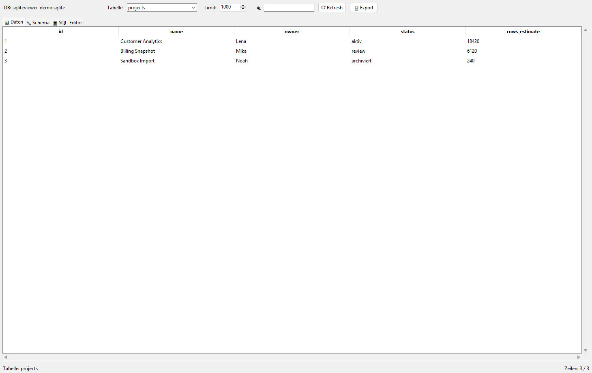
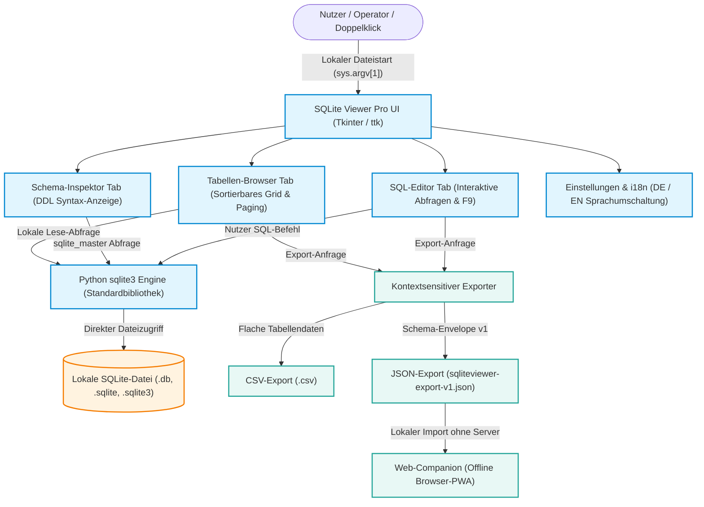
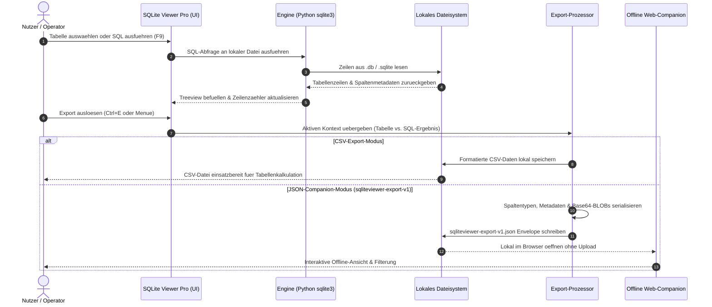

# SQLiteViewer

<p align="center">
  <a href="https://www.python.org/"></a>
  <a href="LICENSE"></a>
  <a href="tests/"></a>
  <a href="store_package.json"></a>
  <a href="THIRD_PARTY_LICENSES.md"></a>
  <a href="THIRD_PARTY_LICENSES.md"></a>
  <a href="SECURITY.md"></a>
  <a href="https://github.com/file-bricks"></a>
  <a href="https://github.com/open-bricks"></a>
  <a href="llms.txt"></a>
</p>

<p align="center">
  <a href="README.md">English</a> | <b>Deutsch</b>
</p>

> [!NOTE]
> **SQLiteViewer** (im Windows-Auftritt als *SQLite Viewer Pro*) ist ein unprivilegierter, lokaler SQLite-Datenbank-Browser auf Basis von Standard-Python und Tkinter. Er garantiert **Zero Network Egress**, kommt **ohne externe Pip-Laufzeitabhängigkeiten** aus und arbeitet zu 100% offline. Maschinenlesbarer Projektkontext ist in [`llms.txt`](llms.txt) indexiert.

---

## Schnellnavigation

1. [Was ist SQLiteViewer?](#was-ist-sqliteviewer)
2. [Zielgruppen & Auffindbarkeit](#zielgruppen--auffindbarkeit)
3. [Architektur & Datenfluss](#architektur--datenfluss)
4. [Export-Lebenszyklus](#export-lebenszyklus)
5. [Vergleichsmatrix gegenüber Alternativen](#vergleichsmatrix-gegenüber-alternativen)
6. [Kernfunktionen](#kernfunktionen)
7. [Schnellstart & Installation](#schnellstart--installation)
8. [Nutzung & Arbeitsablauf](#nutzung--arbeitsablauf)
9. [Tastenkürzel](#tastenkürzel)
10. [Exportformat & Web-Companion](#exportformat--web-companion)
11. [Microsoft Store & Paketierung](#microsoft-store--paketierung)
12. [Governance & System-Invarianten](#governance--system-invarianten)
13. [Drittanbieter-Lizenzen & Transparenz](#drittanbieter-lizenzen--transparenz)
14. [Ökosystem & Schwesterprojekte](#ökosystem--schwesterprojekte)
15. [Sicherheit & Datenschutz](#sicherheit--datenschutz)
16. [Vertragstests & Verifikation](#vertragstests--verifikation)

---

## Was ist SQLiteViewer?

**SQLiteViewer** ist ein leichtgewichtiger, portabler Desktop-Browser für `.db`-, `.sqlite`- und `.sqlite3`-Datenbankdateien. Entwickelt für Programmierer, Analysten, Systemadministratoren und datenschutzbewusste Anwender, ermöglicht das Tool das sofortige Öffnen lokaler Datenbanken, die Prüfung von Tabellen und DDL-Schemas, das Filtern von Datensätzen, das Ausführen von Ad-hoc-SQL-Abfragen und den Export sichtbarer Daten als CSV oder strukturiertes JSON – völlig ohne Cloud-Anbindung oder schwere Laufzeitumgebungen.



---

## Zielgruppen & Auffindbarkeit

SQLiteViewer wurde für vier zentrale Nutzergruppen und Anwendungsfälle konzipiert:

### `[PERSONA-01]` Python- & Desktop-Entwickler
- **Profil:** Softwareingenieure, die Desktop-Anwendungen (PySide, Tkinter, PyQt), Web-Backends (FastAPI, Django) oder Kommandozeilenwerkzeuge entwickeln und Test-Fixtures oder Anwendungsdatenbanken schnell inspizieren und debuggen wollen.
- **Problemstellung:** Lange Startzeiten und Speicherhunger schwerer Java-IDEs (DBeaver) oder das Installieren großer C++-Pakete nur für eine kleine lokale SQLite-Testdatenbank.
- **High-Intent-Suchphrasen:**
  - `local-first SQLite viewer Python Tkinter`
  - `lightweight SQLite browser without bloat`
  - `inspect sqlite3 db from python app`
  - `python tkinter sqlite gui table browser`

### `[PERSONA-02]` Datenschutzsensible Analysten & Wissenschaftler
- **Profil:** Forscher, Medizininformatiker und Auditoren, die vertrauliche Umfragedaten, klinische Datensätze oder Laborprotokolle auf abgeschotteten Systemen analysieren.
- **Problemstellung:** Moderne SaaS-Datenbank-Dashboards und Online-Viewer übertragen Metadaten oder Zeileninhalte über das Netzwerk und verletzen strikte Datenschutzauflagen.
- **High-Intent-Suchphrasen:**
  - `offline SQLite database viewer zero network egress`
  - `air-gapped SQLite viewer privacy first`
  - `open source local SQLite explorer`
  - `datenschutzkonformer SQLite Viewer offline`

### `[PERSONA-03]` DevOps, Systemadministratoren & Support-Teams
- **Profil:** Incident-Responder und IT-Techniker, die Fehlerdiagnosen auf Kundenworkstations durchführen, auf denen keine Administratorrechte zur Softwareinstallation vorliegen.
- **Problemstellung:** Herkömmliche Installer lösen UAC-Prompts aus und hinterlassen Spuren im Betriebssystem.
- **High-Intent-Suchphrasen:**
  - `portable SQLite viewer Windows unprivileged`
  - `inspect sqlite database RunAsInvoker`
  - `support triage sqlite viewer usb stick`
  - `portable sqlite table browser windows`

### `[PERSONA-04]` Microsoft Store Endnutzer & Non-Technical Evaluators
- **Profil:** Anwender unter Windows 10/11, die eine `.db`- oder `.sqlite`-Datei per Doppelklick öffnen und tabellarisch durchsuchen möchten, ohne Konsolenbefehle lernen zu müssen.
- **Problemstellung:** Windows bietet standardmäßig keinen integrierten Betrachter für SQLite-Dateien.
- **High-Intent-Suchphrasen:**
  - `SQLite Viewer Pro Microsoft Store`
  - `Windows 11 open db file viewer`
  - `double click sqlite file Windows`
  - `sqlite db datei oeffnen windows 10`

---

## Architektur & Datenfluss

SQLiteViewer läuft als schlanker, unprivilegierter Einzelprozess (`RunAsInvoker`). Die grafische Benutzeroberfläche kommuniziert direkt mit der in Python integrierten `sqlite3`-Engine, wodurch sämtliche Datenbankzugriffe vollständig auf dem lokalen Host verbleiben.



---

## Export-Lebenszyklus

Der Datenexport folgt einem strikten kontextsensitiven Protokoll. Der aktuell geöffnete Tab bestimmt, ob Zeilen der Tabellenansicht oder Abfrageergebnisse des SQL-Editors exportiert werden.



---

## Vergleichsmatrix gegenüber Alternativen

SQLiteViewer wurde als fokussiertes, lokales Desktop-Werkzeug konzipiert. Die Gegenüberstellung mit bekannten Alternativen über 10 Kriterien verdeutlicht die Positionierung:

| Kriterium | SQLiteViewer (`file-bricks`) | DB Browser for SQLite | DBeaver | SQLiteStudio | Cloud SQL SaaS |
|---|---|---|---|---|---|
| **Zero Network Egress** (`INV-LOCAL-01`) | **JA (100% Offline)** | JA | NEIN (Telemetrie/Updates) | JA | NEIN (Cloud-Zwang) |
| **Unprivilegierte Ausführung** (`INV-LOCAL-02`) | **JA (RunAsInvoker)** | JA | Oft Admin-Rechte nötig | JA | Browser-Sandbox |
| **Laufzeit-Abhängigkeiten** (`INV-LOCAL-03`) | **Null (Python Standard)** | C++ / Qt-Bibliotheken | Schwer (JVM ~300 MB) | C++ / Qt-Bibliotheken | Server-Infrastruktur |
| **Nicht-destruktiver Standard** (`INV-LOCAL-04`)| **JA (Read-Only Default)** | Schreib-/Editierfokus | Schreib-/Editierfokus | Schreib-/Editierfokus | Direkte Mutation |
| **Kontextsensitiver Export** (`INV-LOCAL-05`)| **JA (CSV + JSON-Envelope)**| Nur CSV | CSV, JSON, XML | CSV, JSON, HTML | Cloud-Datenexport |
| **Offline Web-Companion** (`INV-LOCAL-06`)| **JA (`web_companion/`)** | NEIN | NEIN | NEIN | Reine Web-App |
| **Microsoft Store Paketierung** (`INV-LOCAL-07`) | **JA (`9P6H501XB8JT`)** | Winget / MSI | Winget / MSI | Zip / Setup | Keine Desktop-App |
| **Permissive Lizenz** (`INV-LOCAL-08`) | **MIT (Zero Copyleft)** | GPLv3 (Copyleft) | Apache / Kommerziell | GPLv3 (Copyleft) | Proprietär |
| **Zweisprachige Parität EN/DE** (`INV-LOCAL-09`) | **JA (100% Wechselseitig)**| Teilweise UI | Teilweise UI | Teilweise UI | Nur Englisch |
| **Sicherheits-SLA** (`INV-LOCAL-10`) | **48h Reaktions-SLA** | Community Best Effort | Kommerzielles SLA | Community Best Effort | Anbieter-SLA |

---

## Kernfunktionen

- **Schneller Tabellen-Browser:** Sortierbare Spalten, dynamische Spaltenbreiten und responsives Paging für Datenbanken mit vielen Datensätzen.
- **Interaktiver Schema-Inspektor:** Prüfung von `CREATE TABLE`-, `CREATE INDEX`- und `CREATE TRIGGER`-DDL-Anweisungen.
- **SQL-Abfrage-Editor:** Mehrzeilige SQL-Konsole mit Ausführung per `F9`, Zeilenzähler und Laufzeitmessung.
- **Echtzeit-Suche:** Schnelles Filtern sichtbarer Zeilen über alle Spalten hinweg.
- **Kontextsensitiver Export:** Gezielter Export aktiver Tabellen- oder Abfragedaten als CSV oder strukturiertes JSON (`sqliteviewer-export-v1.json`).
- **Dynamische Internationalisierung:** Umschaltung zwischen Deutsch und Englisch im laufenden Betrieb über das Menü.
- **Offline Web-Companion:** Analyse exportierter JSON-Datensätze im Browser ohne Server und ohne Netzwerkzugriff.
- **Store-zertifiziert:** Vollständig vorbereitet für den Microsoft Store (`SQLite Viewer Pro`) und als eigenständiges Python-Skript nutzbar.

---

## Schnellstart & Installation

### Option A: Microsoft Store (Empfohlen für Windows)

Installation direkt über den offiziellen Microsoft Store mit automatischer Dateiverknüpfung:
- **Produktname:** SQLite Viewer Pro
- **Store-ID:** `9P6H501XB8JT`
- **Store-Link:** [SQLite Viewer Pro im Microsoft Store](https://apps.microsoft.com/detail/9P6H501XB8JT)

### Option B: Start aus dem Quellcode (Alle Plattformen)

Voraussetzungen: Python 3.10 oder neuer (Tkinter ist in regulären Python-Installationen enthalten).

```bash
# Repository klonen
git clone https://github.com/file-bricks/SQLiteViewer.git
cd SQLiteViewer

# Direkt starten
python SQLiteViewer.py
```

Eine bestimmte Datenbank direkt öffnen:

```bash
python SQLiteViewer.py pfad/zur/datenbank.sqlite
```

---

## Nutzung & Arbeitsablauf

1. **Datenbank öffnen:** `Strg+O` drücken oder eine `.db`-, `.sqlite`- bzw. `.sqlite3`-Datei per Drag & Drop ins Fenster ziehen.
2. **Tabellen inspizieren:** Gewünschte Tabelle in der linken Seitenleiste auswählen. Der Data-Tab zeigt die Datensätze im sortierbaren Raster.
3. **Suchen & Filtern:** Mit `Strg+F` in die Suchleiste springen, Suchbegriff eingeben und `Enter` drücken.
4. **Schema prüfen:** Im Schema-Tab die exakten Spaltendefinitionen, Primärschlüssel und Fremdschlüssel einsehen.
5. **SQL ausführen:** In den SQL-Editor-Tab wechseln, Abfrage verfassen und mit `F9` ausführen.
6. **Daten exportieren:** Mit `Strg+E` den Exportdialog öffnen und zwischen CSV oder `sqliteviewer-export-v1.json` wählen.

---

## Tastenkürzel

| Tastenkürzel | Aktion | Bereich |
|---|---|---|
| `Strg+O` | SQLite-Datenbankdatei öffnen | Global |
| `Strg+F` | Suchleiste fokussieren | Data-Tab |
| `Strg+E` | Kontextsensitiven Export aufrufen | Data- / SQL-Tab |
| `F5` | Aktuelle Tabellendaten neu laden | Data-Tab |
| `F9` | Eingegebene SQL-Abfrage ausführen | SQL-Editor-Tab |
| `Esc` | Suche zurücksetzen oder Dialog schließen | Global |

---

## Exportformat & Web-Companion

SQLiteViewer nutzt für strukturierte Exporte die Spezifikation **`sqliteviewer-export-v1`** (vollständig dokumentiert in [`EXPORTFORMAT.md`](EXPORTFORMAT.md)). JSON-Exporte enthalten Herkunfts- und Filtermetadaten:

```json
{
  "schema_version": "sqliteviewer-export-v1",
  "app_name": "SQLite Viewer Pro",
  "app_version": "2.1.0",
  "exported_at": "2026-09-14T17:50:00+02:00",
  "source": {
    "database_path": "C:/data/sample.sqlite",
    "database_name": "sample.sqlite",
    "view": "table",
    "table": "records",
    "query": null,
    "row_limit": 1000,
    "sort_column": "id",
    "sort_descending": false
  },
  "columns": ["id", "timestamp", "payload"],
  "row_count": 1,
  "result_rows": [
    {"id": 1, "timestamp": "2026-09-14 12:00:00", "payload": "Sample"}
  ]
}
```

Die erzeugte Datei kann direkt im eigenständigen Browser-Tool [`web_companion/`](web_companion/) abgelegt werden, um die Daten rein clientseitig ohne Server-Upload interaktiv zu sichten.

---

## Microsoft Store & Paketierung

SQLiteViewer ist als Standard-Desktop-Bridge-Anwendung für Windows paketiert:
- **Paket-Identität:** `Geiger.SQLiteViewerPro`
- **Herausgeber-CN:** `CN=52596601-BAB4-4F3F-B182-E8F3F273B202`
- **Store-ID:** `9P6H501XB8JT`
- **Ausführungs-Alias:** `sqliteviewer.exe`
- **Manifest:** `store_package.json` und `AppxManifest.xml`
- **Build-Dateien:** `build_exe.bat` und `SQLiteViewer.spec`

---

## Governance & System-Invarianten

SQLiteViewer erfüllt alle zehn System-Invarianten des `open-bricks`- und `file-bricks`-Desktop-Verbunds:

| Invariante | Bezeichnung | Technische Umsetzung |
|---|---|---|
| `INV-LOCAL-01` | **Zero Network Egress** | 100% offline. Keine HTTP-Requests, Telemetrie, Cookies oder Cloud-Verbindungen. |
| `INV-LOCAL-02` | **Unprivilegierte Ausführung** | Läuft im regulären Benutzerkontext (`RunAsInvoker`). Keine Administrator-Höherstufung. |
| `INV-LOCAL-03` | **Keine externen Laufzeitabhängigkeiten** | Basiert ausschließlich auf der Python-Standardbibliothek (`sqlite3`) und Tkinter. |
| `INV-LOCAL-04` | **Nicht-destruktive Dateiverknüpfung** | Schreibgeschützter Ansichtsmodus als Standard. Datenbankdateien werden beim Öffnen nicht verändert. |
| `INV-LOCAL-05` | **Kontextsensitiver Dual-Export** | Unterstützung von Standard-CSV sowie strukturiertem JSON-Schema mit Metadaten. |
| `INV-LOCAL-06` | **Offline Browser-Companion** | Mitgeliefertes HTML/JS-Werkzeug (`web_companion/`) zur serverlosen Betrachtung. |
| `INV-LOCAL-07` | **Standard Store-Paketierung** | Saubere AppX/MSIX-Kompatibilität mit registrierter Store-ID `9P6H501XB8JT`. |
| `INV-LOCAL-08` | **100% Permissive Open-Source-Lizenz** | Reines MIT. Keine Copyleft-Verpflichtungen auf Benutzerdaten oder Pipelines. |
| `INV-LOCAL-09` | **Zweisprachige Parität EN/DE** | Vollständig wechselseitige Dokumentation und dynamische Lokalisierung im Interface. |
| `INV-LOCAL-10` | **Sicherheits- & Vulnerability-SLA** | Dokumentierte 48-Stunden-Reaktionszeit bei gemeldeten Sicherheitsvorfällen. |

---

## Drittanbieter-Lizenzen & Transparenz

SQLiteViewer setzt konsequent auf offene, freie Standards. Die vollständige Lizenzdokumentation ist in [`THIRD_PARTY_LICENSES.md`](THIRD_PARTY_LICENSES.md) hinterlegt.

- **Python Standardbibliothek:** `PSF-2.0` (Permissiv, kein Copyleft)
- **Tcl/Tk Fenster-Framework:** `Tcl/Tk License` (BSD-artig)
- **Entwicklung & Qualitätssicherung:** `pytest` (MIT), `ruff` (MIT / Apache-2.0)
- **Eigenständigkeit Ihrer Daten:** Alle geladenen Datenbanken, Abfragen und exportierten Dateien bleiben zu 100% Ihr alleiniges Eigentum.

---

## Ökosystem & Schwesterprojekte

SQLiteViewer wird innerhalb der Organisation [**file-bricks**](https://github.com/file-bricks) geführt und ist Teil der freien Desktop-Suite [**open-bricks**](https://github.com/open-bricks).

Verwandte Werkzeuge im Verbund:
- [**LaunchBoards**](https://github.com/file-bricks/LaunchBoards): Lokaler, tastaturgesteuerter Schnellstarter für Workspaces.
- [**SoftwareCenter**](https://github.com/file-bricks/SoftwareCenter): Zentraler, unprivilegierter Windows-Software- und Paketmanager.
- [**ProSync**](https://github.com/file-bricks/ProSync): Deterministische Verzeichnissynchronisation und differenzielle Backups.
- [**ProFiler**](https://github.com/file-bricks/ProFiler): Leistungsfähiger Dateisystem-Profiler und Speicherplatz-Analysator.
- [**CleanMarkdown**](https://github.com/doc-bricks/CleanMarkdown): Deterministischer Linter und Formatierer für Markdown-Dokumente.

---

## Sicherheit & Datenschutz

- **Datenschutzerklärung:** Alle Details in [`PRIVACY_POLICY.md`](PRIVACY_POLICY.md). SQLiteViewer erfasst keine Benutzerdaten und sendet keine Telemetrie.
- **Sicherheitsrichtlinie & SLA:** Meldeverfahren für Schwachstellen sind in [`SECURITY.md`](SECURITY.md) beschrieben. Wir garantieren eine **Reaktionszeit von maximal 48 Stunden** (`INV-LOCAL-10`).

---

## Vertragstests & Verifikation

Die Integrität der Funktionen, Lokalisierungen und Metadaten wird durch eine automatisierte Testsuite gesichert:

```bash
# Sämtliche Unit- und Vertragstests ausführen
pytest -ra -v
```

Enthaltene Testmodule:
- `tests/test_sql_execution.py`: Sichere Abfrageausführung, Fehlerbehandlung und Datentypen.
- `tests/test_translations.py`: Vollständige Schlüsselparität zwischen deutscher und englischer Übersetzung.
- `tests/test_cli_db_argument.py`: Pfadvalidierung und CLI-Parameterprüfung.
- `tests/test_store_screenshots.py`: Asset-Generierung für die Windows-Store-Präsenz.
- `tests/test_metadata.py`: Vertragstests für Banner-Schutz (`HOOK-BANNER-ASSET-01`), Mermaid-Syntax, zweisprachige Parität, Zielgruppen und Vergleichsmatrix.

---

## Lizenz & Haftung

Dieses Projekt ist unter der [MIT-Lizenz](LICENSE) lizenziert.

### Haftung (§ 521 BGB)

Dieses Projekt ist eine unentgeltliche Open-Source-Schenkung im Sinne der §§ 516 ff. BGB. Die Haftung des Urhebers ist gemäß § 521 BGB auf Vorsatz und grobe Fahrlässigkeit beschränkt. Ergänzend gilt der Haftungsausschluss der MIT-Lizenz. Nutzung auf eigenes Risiko. Keine Wartungszusage, keine Verfügbarkeitsgarantie, keine Gewähr für Fehlerfreiheit oder Eignung für einen bestimmten Zweck.

*This project is an unpaid open-source donation. Liability is limited to intent and gross negligence (§ 521 German Civil Code). Use at your own risk. No warranty, no maintenance guarantee, no fitness-for-purpose assumed.*
